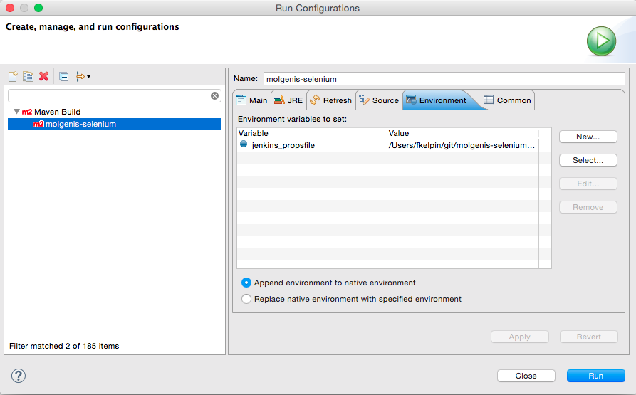

# molgenis-selenium

This project uses selenium and the molgenis REST client to test a running molgenis instance.
You can configure which instance should be tested in a property file.

The property file can have any name.
A sample property file that tests on your local system is in `src/test/resources/local.properties`.

To run the tests, you run maven with the target `test`.
The configuration file should be specified by setting the environment variable

    jenkins.propsfile=/path/to/the/properties

